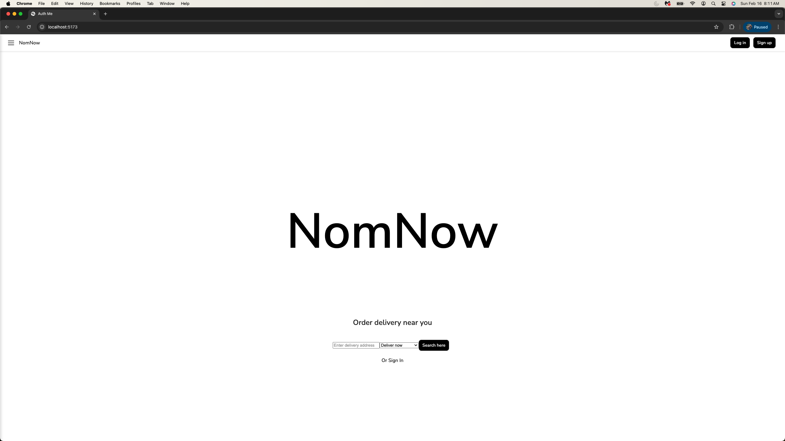
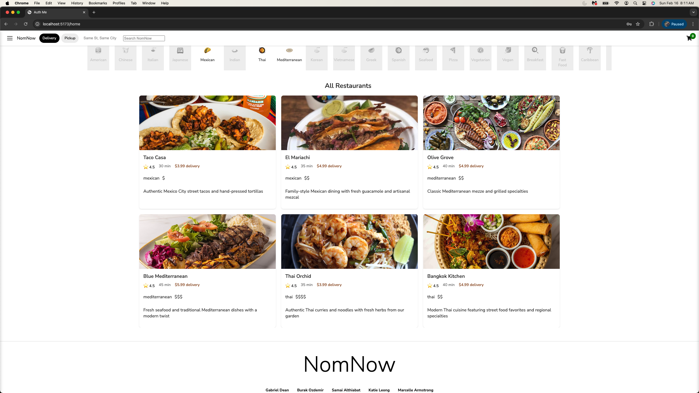
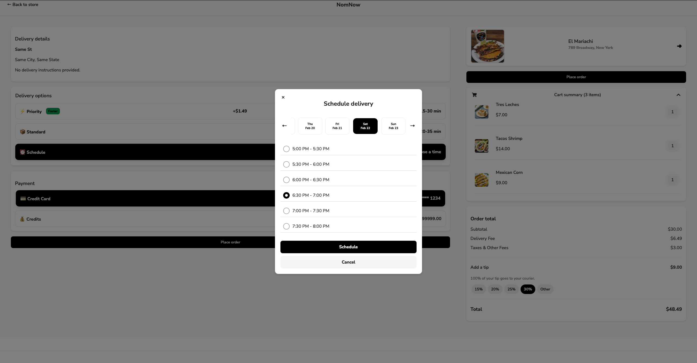
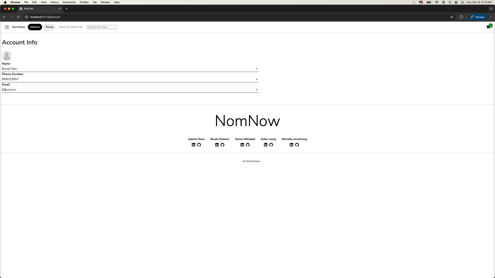

# About NomNow 

NomNow is an online platform that connects people with local restaurants, similar to UberEats. It allows users to browse restaurants and their menus, place new orders, reorder past meals, leave restaurant reviews, and create their own restaurant listings and menus.

[Visit the Live Site](https://nomnow-75lb.onrender.com/) 



## Tech Stack

### Frameworks and Libraries
 
 
 
 
 
 


 ### Database:
 
 
 ### Hosting:
 

## Features & Functionality

1. Restaurants
2. Menu Items
3. Reviews
4. Cart
5. Checkout
6. Past Orders
7. Manage Account


### Restaurants:
Users can browse restaurants to explore and order from.



### Menu Items:
Users can view all menu items for each restaurant.


### Reviews:
Users can read reviews for each restaurant, and leave reviews for restaurants they have ordered from.


### Cart:
Users can add items to their cart from a single restaurant.


### Checkout:
Users can checkout to place an order from a single restaurant.



### Past Orders:
Users can view and re-order past orders.


### Manage Account:
Users can manage their account and create, update, and delete restaurants and menu items.



## Future Features

1. Search

## Setup
1. Clone this repository 

2. Install dependencies

      ```bash
      pipenv install -r requirements.txt
      ```

3. Create a **.env** file based on the example with proper settings for your
   development environment

4. Make sure the SQLite3 database connection URL is in the **.env** file

5. This starter organizes all tables inside the `flask_schema` schema, defined
   by the `SCHEMA` environment variable.  Replace the value for
   `SCHEMA` with a unique name, **making sure you use the snake_case
   convention**.

6. Get into your pipenv, migrate your database, seed your database, and run your Flask app

   ```bash
   pipenv shell
   ```

   ```bash
   flask db upgrade
   ```

   ```bash
   flask seed all
   ```

   ```bash
   flask run
   ```


## Contact

• Burak Ozdemir | &nbsp; [GitHub](https://github.com/burakoncuy)

• Gabriel Dean | &nbsp; [GitHub](https://github.com/gabrdean)

• Katie Leong | &nbsp; [GitHub](https://github.com/heykatie)

• Marcelle Armstrong | &nbsp; [GitHub](https://github.com/Mcode4)

• Samai Althiabat | &nbsp; [GitHub](https://github.com/SamaAlt)